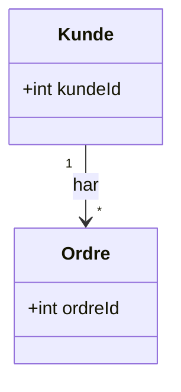

# uml-demo


```mermaid
classDiagram
    Kunde "1" --> "*" Ordre : har
    
    class Kunde {
        +int kundeId
    }
    
    class Ordre {
        +int ordreId
    }
```

her kommer der noget java kode

```java
int count = 0;
```


her kommer noget sql

```sql
select * from varer;
```
